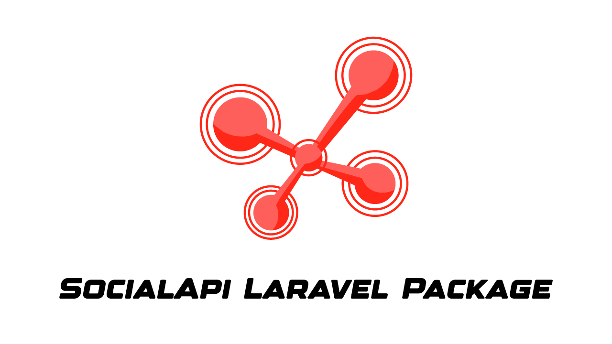

# SocialApi

This package offers a simplified solution for login using social media accounts.

We go mainly to the Backend developers so that they can use them when working with API and in close collaboration between them.The frontend send the token then through this package we can bring the information you want.

## Installation

##### 1 - Dependency

The first step is using composer to install the package and automatically update your composer.json file, you can do this by running:

```shell
composer require syrian-open-source/social-api
```

## Usage

1. You can use this package in your laravel project to get user data from (facebook,google,github,linkedin,apple)
2. In your Controller use this code:

```shell
use Illuminate\Http\Request;
use SOS\SocialApi\Facades\SocialApiFacade as SocialApi;

class TestController extends Controller
{
    public function ExampleController(Request $request)
        {
            return SocialApi::login($request->platform, $request->platform_token);
        }
}

```

## Changelog

Please see the [CHANGELOG]() for more information about what has changed or updated or added recently.

## Security

If you discover any security related issues, please email them first to contact@somar-kesen.com
if we do not fix it within a short period of time please open a new issue describe your problem.

## Credits

- [Somar kesen](https://www.linkedin.com/in/somarkesen/)
- [Ali Alshikh](https://github.com/AliAlshikh99)
- [Homam Haidar](https://github.com/HomamHaidar)
- [Mary Ali](https://github.com/Marikamal)
- [Mustafa Fares](https://github.com/MustafaFares445)

## About Syrian Open Source

The Syrian Open Source platform is the first platform on GitHub dedicated to bringing Syrian developers from different cultures and experiences together, to work on projects in different languages, tasks, and versions, and works to attract Syrian developers to contribute more under one platform to open source software, work on it, and issue it with high quality and advanced engineering features, which It stimulates the dissemination of the open-source concept in the Syrian software community, and also contributes to raising the efficiency of developers by working on distributed systems and teams.
